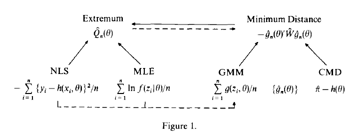

# `mindist`: Minimum distance estimation in `R`

<!-- badges: start -->
[](https://travis-ci.com/linogaliana/mindist)
[](https://codecov.io/gh/linogaliana/mindist?branch=master)
<!-- badges: end -->



The goal of mindist is to ...

## Installation

You can install the development version with:

``` r
remotes::install_github("linogaliana/mindist")
```

